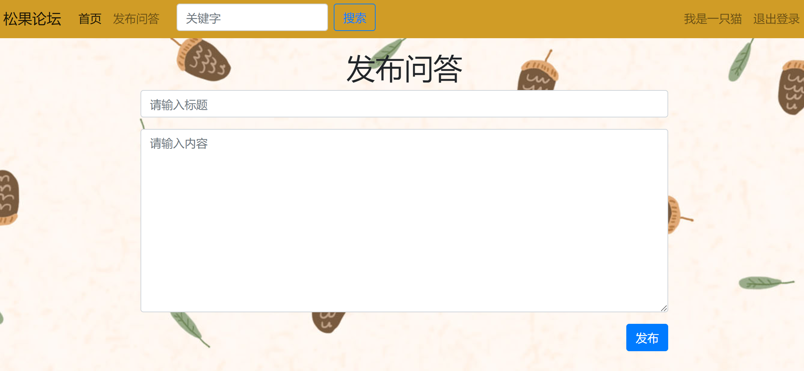

### 一、项目简介
&emsp;&emsp;本项目是一个在线论坛项目，用户可以发布问答以及回复问答，主体功能有注册/登录、发布问答、评论回复。  
&emsp;&emsp;项目采用Flask框架，主体功能是跟随B站黄勇老师的课程完成开发，B站链接如下：  
&emsp;&emsp;【2022版-零基础玩转Python Flask框架-学完可就业】 https://www.bilibili.com/video/BV17r4y1y7jJ?share_source=copy_web  
在原来课程项目的框架下，添加了个人中心功能，在个人中心可以完成个人基本信息的修改、头像上传、查看图表统计等功能。  
项目截图如下：  
1. 首页  
  
2. 发布问答  
  
3. 评论回复  
  
4. 个人中心  

### 二、技术简介
&emsp;&emsp;项目主体采用的是Flask框架，后台用到了蓝图技术和jinja2模板。数据库使用的是MYSQL5.7和Redis5，MYSQL存储项目运行的用户数据，Redis用来存储邮箱验证码。
### 三、主要文件
1. config.py 配置文件  
2. echarts.py 绘图文件  
3. forms.py 表单验证文件
4. manager.py Migrate运行文件  
5. models.py 数据库模块文件
6. 蓝图文件：
- QA.py 首页视图函数处理和登录后相关业务的视图函数处理文件
- user.py 用户注册、登录等视图函数处理文件
### 四、运行方法
1. 使用pycharm打开项目，配置好解释器：选择python 解释器位置：flask-env/Scripts/python.exe
2. 先删除migrations文件夹，再在MySQL数据库中新建一个forum数据库，编码格式utf-8
3. 在pycharm中打开终端，进入flask-env虚拟环境，执行命令：
- 运行命令1: python manager.py db init
- 运行命令2: python manager.py db migrate
- 运行命令3: python manager.py db upgrade
4. 运行项目主文件main.py, 在浏览器中打开http://127.0.0.1:5000
